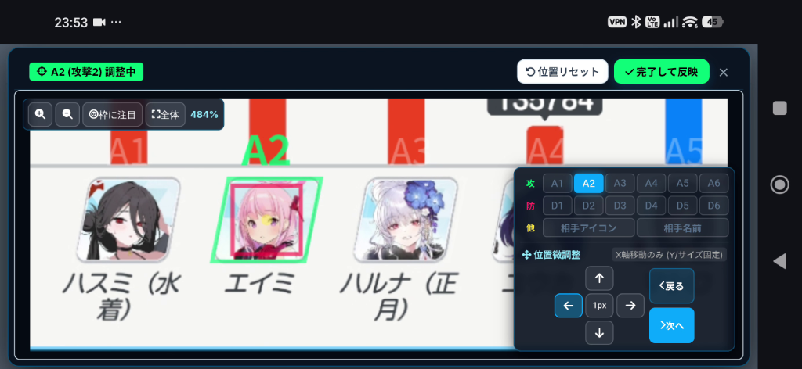
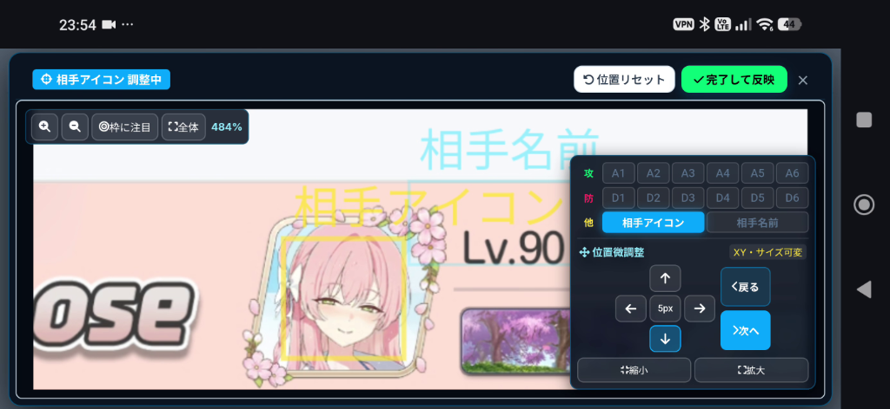
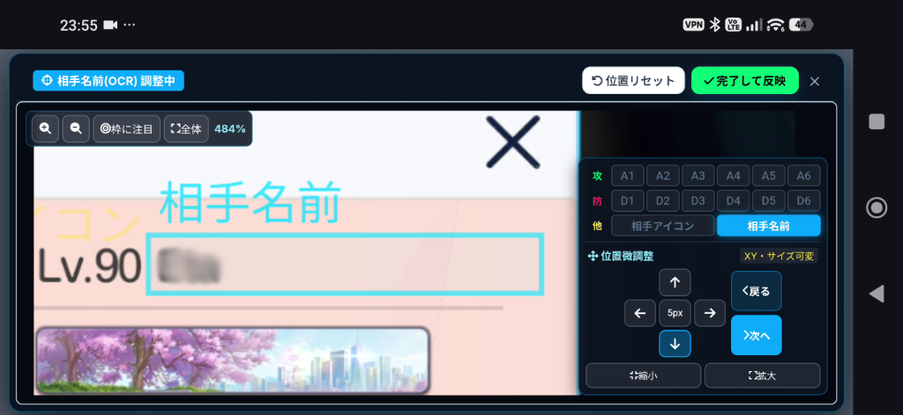
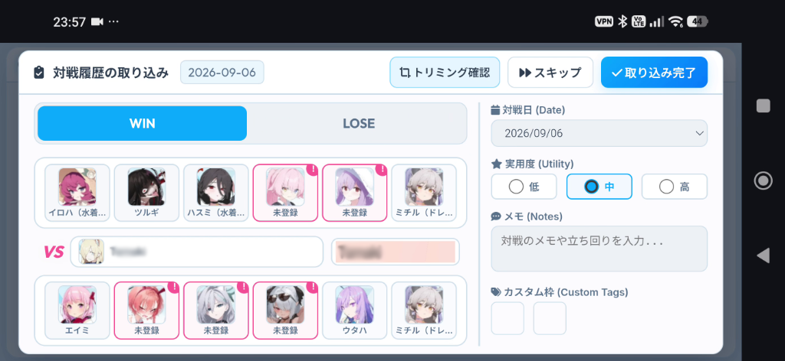
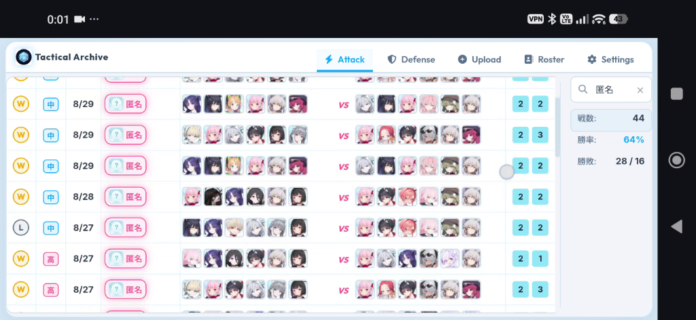

# Tactical Archive (タクティカル・アーカイブ)

『ブルーアーカイブ（Blue Archive）』戦術対抗戦の対戦履歴をスクリーンショットから自動認識・記録・分析するローカルファーストの戦績管理ツールです。

[](#)
[](#)
[](#)
[](LICENSE)
[](#)

---

## 📸 画面イメージと使い方ガイド

### 💡 アップロードする対象画像について（どのスクショを使うか？）

本ツールが解析・自動記録の対象としているのは、**ゲーム内の「戦術対抗戦のリザルト画面（対戦終了画面）」**のスクリーンショットです。

- **対象となる画面**:
  - 対戦終了直後に表示される**リザルト画面（勝利「WIN」または敗北「LOSE」が表示されている画面）**。
- **画面に含まれる要素**:
  - 画面上部：対戦相手の指揮官アイコンおよび指揮官名
  - 画面左側：自分の攻撃編成生徒アイコン（味方6名）
  - 画面右側：相手の防衛編成生徒アイコン（敵6名）
- **撮影・アップロード時のポイント**:
  - 端末で撮影した**全画面スクリーンショット（トリミングや縮小・加工をしていない元の画像）**をそのままアップロードしてください。
  - 「Upload」タブへのドラッグ＆ドロップ、またはファイル選択ボタンから**複数枚まとめての一括アップロード**が可能です。
  - *※対戦中のバトル画面や、ロビー画面、戦績履歴リスト画面などは対象外です。必ず対戦直後のリザルト画面を撮影してください。*

---

### 1. 初回起動時のトリミング位置指定（キャリブレーション）

> **💡 完全ローカル環境で動作させるための初回手動設定**  
> 本ツールはプライバシー保護と完全オフライン動作のため、画像を外部サーバーに送信せず、すべての画像解析・OCR・アイコン照合を端末内のローカルエンジンで処理します。  
> そのため、初回起動時のみお使いの端末解像度・アスペクト比（16:9 / 18:9 / 19.5:9 / 20:9 等）に合わせたトリミング枠の位置指定（ウィザード形式）が必要です。

| 調整ステップ | 画面イメージ | 説明 |
|---|---|---|
| **① 編成生徒枠の指定** |  | 攻撃・防衛の生徒アイコン（A1〜A6, D1〜D6）の顔枠をガイドに合わせて調整します。 |
| **② 相手アイコン枠の指定** |  | リザルト画面右上に表示される対戦相手の指揮官アイコン位置を合わせます。 |
| **③ 相手名前(OCR)枠の指定** |  | 相手指揮官名の表示領域を矩形枠で囲みます。枠を正確に合わせることで文字認識精度が向上します。 |

*※設定した位置情報は端末内（IndexedDB）にプロファイルとして保存されるため、2回目以降の入力は不要です。*

---

### 2. 対戦リザルトの取り込み・確認画面（ヒューマン・イン・ザ・ループ）

リザルト画像をアップロードすると自動解析され、確認ダイアログが表示されます。

<p align="center">
  
</p>

- **未登録生徒の赤枠表示とワンタップ登録**:  
  名簿に未登録の生徒や新衣装の生徒が含まれている場合は**赤枠（！マーク付き）**で強調表示されます。スロットをタップして生徒名を指定するだけで即座に図鑑登録され、次回以降は自動で一致認識されます。
- **対戦相手名のOCR確認と自動リネーム辞書**:  
  対戦相手の名前はフォントや背景によりOCRの認識精度にブレが生じる場合があります。最初のうちは右側に並んで表示されるトリミング元画像を確認しながら正しい名前に修正してください。  
  **一度手動で修正して取り込みを完了すると自動的に「修正辞書」へ登録**され、次回以降は同じ相手の名前が自動で正しい表記に変換されます。

---

### 3. 戦績履歴画面とスマート絞り込み

対戦履歴の一覧表示、検索、および詳細な編成分析が可能です。

<p align="center">
  
</p>

- **「匿名」相手の絞り込み**:  
  上位の戦術対抗戦などで多用される「匿名」プレイヤーの履歴も、検索バーに「匿名」（またはひらがな「とくめい」）と入力することで瞬時に絞り込み表示できます。
- **カスタム枠による固有武器ランク記録（青/黄）**:  
  匿名プレイヤーは名前による判別が難しいため、相手の防衛D5/D6（Special生徒等）の固有武器ランク（固有2・固有3など）で絞り込み・識別を行うのが効果的です。  
  戦績詳細画面の「カスタム枠」を使って右端に**青や黄色の数字（例: `2` `2`、`2` `3`）**を記録しておくと、テーブル一覧の右端にバッジ表示され、同一相手の特定や対策の検討に非常に便利です。

---

## 📌 主な機能

### 1. スクリーンショット一括自動認識 (Batch OCR & Image Matching)
- 戦術対抗戦のリザルト画面（勝利/敗北）のスクリーンショットをドラッグ＆ドロップまたはファイル選択するだけで、自動で対戦情報を解析します。
- **対戦相手名認識**: Tesseract OCR による相手指揮官名の高精度自動読み取り。
- **編成生徒の画像認識**: テンプレートマッチング（ZNCC）および画像特徴量比較により、生徒アイコンから自動で編成生徒を特定。
- **画面解像度・アスペクト比 自動キャリブレーション**: 端末の画面比率（16:9 / 18:9 / 19.5:9 / 20:9 など）を自動検出してトリミング枠を最適化。
- **対戦相手名プレビュー照合**: OCR結果の確認用にトリミング元画像を並べて表示し、登録確認が容易。

### 2. 戦績ダッシュボード＆スマート絞り込み (Analytics & Fast Filter)
- **統計ダッシュボード**: 総対戦数、勝率、勝敗比（Win/Lose）をリアルタイム自動集計。
- **高速ページング＆無限スクロール**: 大量の対戦履歴（数十〜数千件）でも初期描画0ms、スクロールに合わせて30件ずつスムーズに追加描画。
- **多角的フィルタリング**:
  - **ひらがな・カタカナ相互あいまい検索**: 相手指揮官名がカタカナ（例: アザミ）でもひらがな（例: あざみ）で検索可能。生徒名も同様に双方向一致。
  - 相手指揮官名、編成生徒名でのフリーワード検索。
  - アイコンタップによる特定生徒・配置位置（D1〜D4, Sp5/6）でのワンタップ絞り込み。
  - 統計ダッシュボードタップでフィルター即時解除。

### 3. 生徒名簿管理＆学習機能 (Roster & Learning)
- **生徒名簿辞書**: ふりがな・略称・別衣装生徒に対応したマスター辞書を内蔵。
- **学習機能（ヒューマン・イン・ザ・ループ）**: 認識されなかった生徒や誤認識を手動修正すると、その生徒の新しい顔特徴データを自動蓄積し、次回以降の認識精度が向上。
- **相手名リネーム辞書**: OCRの誤読しやすい文字や愛称を自動変換するリネーム辞書機能。

### 4. 完全ローカル・オフライン対応 (Privacy-First Architecture)
- **外部通信なし**: 解析・画像処理・データベース保存はすべて端末内（IndexedDB / Canvas API / ローカルTesseract）で完結します。
- **個人情報ゼロ**: APIキー、ユーザー登録、ID、パスワード等の機密情報は一切不要かつ保持しません。
- **データバックアップ＆復元**: JSON形式でいつでも戦績・名簿・設定をエクスポート／インポート可能。Android端末の「ダウンロード」フォルダへ直接保存できます。

---

## 📱 インストールと利用方法

### 方式A. Android アプリを直接インストールして使う (推奨)
本リポジトリ内のビルド済み APK ファイルをダウンロードし、Android 端末にインストールしてください。

- **APK ファイルパス**: [`release/TacticalArchive.apk`](release/TacticalArchive.apk)
- **対応OS**: Android 7.0 (API レベル 24) 以上

### 方式B. ソースコードからビルドする (Android Studio)
1. 本リポジトリをクローンまたはダウンロードします。
   ```bash
   git clone https://github.com/roundabout-oxygen/Tactic_Archive.git
   ```
2. Android Studio を起動し、本フォルダを開きます（`File -> Open`）。
3. Gradle の同期が完了したら、`Run` または以下のコマンドでビルドします。
   ```bash
   ./gradlew assembleDebug
   ```
   ビルドされた APK は `app/build/outputs/apk/debug/app-debug.apk` に生成されます。

### 方式C. PC ブラウザで単体実行する (Web 版)
Android 端末がなくても、PC のモダンブラウザ（Chrome, Edge, Firefox 等）で利用可能です。

1. `web/run.bat` をダブルクリックして実行します（Python がインストールされている場合）。
2. または、ターミナルで `web` ディレクトリを開き以下を実行します：
   ```bash
   cd web
   python -m http.server 8000
   ```
3. ブラウザで `http://localhost:8000` にアクセスします。

---

## 🛠 技術スタック

- **Android Platform**: Kotlin, Jetpack Compose, Android WebView (JavaScript Interface), MediaStore API
- **Web Frontend**: HTML5, Modern CSS, Vanilla JavaScript (ES6+)
- **Storage**: IndexedDB (完全ローカルクライアントストレージ)
- **Image Processing**: HTML5 Canvas 2D, ZNCC (Zero-mean Normalized Cross-Correlation)
- **OCR Engine**: Tesseract.js (WebAssembly / On-device OCR)

---

## 🔒 セキュリティおよびプライバシーポリシー

- 本リポジトリのソースコードには、外部通信用 API キー、認証トークン、アカウント ID、パスワード、個人を特定できる情報（個人名・秘密情報）は一切含まれていません。
- アプリケーション動作中も外部サーバーへのアクセスやトラッキング、テレメトリ収集は一切行われません。

---

## ⚖️ 免責事項 (Disclaimer)

- 本ソフトウェアは、ファンによって制作された非公式の戦績管理補助ツールです。
- 『ブルーアーカイブ（Blue Archive）』の著作権、商標権、キャラクター、画像、ロゴ等のすべての知的財産権は、NEXON Games、株式会社Yostar、および各権利所有者に帰属します。
- 本ソフトウェアの使用によって生じたいかなる損害についても、作者は責任を負いません。

---

## 📄 ライセンス

本プロジェクトは [MIT License](LICENSE) のもとで公開されています。
